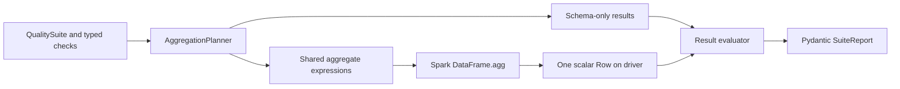

# spark-data-quality

`spark-data-quality` is a small, typed validation library for PySpark DataFrames. It
turns reusable expectations into Spark expressions, combines compatible metrics into
one aggregation, and returns Pydantic reports that remain usable after the Spark
session ends.

The library is intended for batch pipelines, local Spark applications, and managed
Spark runtimes such as Databricks. It has no Databricks-specific runtime dependency.

## Example

```python
from pyspark.sql import SparkSession

from spark_data_quality import (
    AllowedValues,
    ColumnExists,
    InRange,
    NotNull,
    QualitySuite,
    Unique,
)

spark = SparkSession.builder.getOrCreate()
players = spark.createDataFrame(
    [(1, 24, "DE"), (2, 31, "ZA")],
    "player_id long, age long, country string",
)

suite = QualitySuite(
    name="players",
    checks=[
        ColumnExists("player_id"),
        NotNull("player_id"),
        Unique("player_id"),
        InRange("age", min_value=13, max_value=120),
        AllowedValues("country", frozenset({"DE", "ZA", "GB"})),
    ],
)

report = suite.validate(players)
print(report.status)
print(report.model_dump_json(indent=2))
```

## Core capabilities

- Immutable, typed expectation definitions with construction-time configuration checks
- Explicit `PASS`, `FAIL`, and `ERROR` outcomes
- Spark SQL expressions and aggregations only; no Python UDFs or pandas conversion
- One shared aggregate action for compatible validation metrics
- Deterministic check ordering, identifiers, metric aliases, and categorical tie-breaking
- JSON-serializable Pydantic reports with row counts, failure fractions, and diagnostics
- Numeric and string profiling with bounded top-value collection

## Architecture



Check objects define expectations and configuration. The planner resolves schema
requirements and deduplicates scalar metrics. The runner executes the aggregate plan.
The evaluator interprets scalar values and constructs public result models. See
[the architecture notes](docs/architecture.md) for the boundaries and error semantics.

## Execution model

`ColumnExists` and `HasType` use the DataFrame schema and require no action. All valid
row-level checks in a suite contribute expressions to one `DataFrame.agg` action. The
planner deduplicates identical total, null, and other metrics. Exact uniqueness uses
`count` and `countDistinct` in that aggregate; Spark may introduce a shuffle and
multiple physical stages even though the library starts one aggregate action.

The validation runner collects exactly one aggregate row. It never collects source
rows or unbounded values. Execution metadata reports the number of library-level
aggregate actions and scalar expressions; it does not claim to count Spark stages.

The profiler similarly shares scalar statistics in one aggregate action. Each selected
string column needs a separate grouped top-values action. Those results are ordered by
count descending and value ascending, then limited to `top_k` (maximum 100).

## Available checks

| Check | Semantics | Null behavior | Empty DataFrame |
| --- | --- | --- | --- |
| `ColumnExists` | Required name is present | Not applicable | Uses schema |
| `HasType` | Exact Spark `DataType` equality | Type is schema-level | Uses schema |
| `NotNull` | Null count is zero | Nulls fail | Passes |
| `Unique` | Non-null count equals exact distinct count | Ignored | Passes |
| `InRange` | Values satisfy configured inclusive or exclusive bounds | Ignored | Passes |
| `AllowedValues` | Values belong to a non-empty, homogeneous scalar set | Ignored | Passes |
| `MatchesRegex` | Spark `rlike` matches the configured pattern | Ignored | Passes |
| `RowCount` | Count satisfies inclusive minimum/maximum bounds | Not applicable | Depends on bounds |

An absent column produces `FAIL` for `ColumnExists` and `ERROR` for checks that need
that column to continue. A `HasType` mismatch is a valid evaluation and therefore
produces `FAIL`. `InRange`, `MatchesRegex`, and `AllowedValues` reject
incompatible Spark types with `ERROR`. Use `NotNull` beside checks that should also
reject nulls.

For `Unique`, `affected_rows` is duplicate excess: non-null row count minus exact
distinct count. This is stable and aggregate-friendly; it is not the count of every row
participating in a duplicate group.

## Profiling

```python
from spark_data_quality import profile

profile_report = profile(players, ["age", "country"], top_k=5)
print(profile_report.model_dump_json(indent=2))
```

Numeric profiles contain null and distinct counts, minimum, maximum, mean, and sample
standard deviation. String profiles contain null and distinct counts, minimum and
maximum lengths, and bounded frequent values. Unsupported selected types are rejected
before execution instead of receiving ambiguous statistics.

## Installation

Python 3.12+, a compatible JVM, and PySpark 4.x are required.

```bash
pip install spark-data-quality
```

For source development with Poetry:

```bash
poetry install --with dev
```

## Development and testing

The test suite starts a real `local[2]` Spark session. It requires no cloud services,
credentials, or network access after dependencies are installed.

```bash
ruff check .
ruff format --check .
mypy
pytest
```

## Limitations

- Exact `countDistinct` can cause an expensive shuffle on high-cardinality columns.
- The profiler supports numeric and string columns only.
- Top-value profiling performs one bounded grouped action per selected string column.
- Validation reports aggregate failures but do not include failing source-row samples.
- Regex syntax is checked by Python at construction, while evaluation uses Spark's JVM
  regex engine; uncommon engine-specific differences can still surface from Spark.
- Durations are wall-clock observations and are not stable benchmark measurements.

## Roadmap

Technically useful next steps include configurable approximate distinct counts,
cross-column predicates, bounded failing-row samples with explicit privacy controls,
and a second execution group for checks that cannot share scalar aggregation. A CLI is
not planned until it provides value beyond the Python API.

## License

MIT
