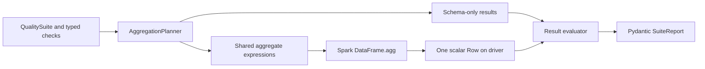

# spark-data-quality

`spark-data-quality` is a small, typed validation library for PySpark DataFrames. It
turns reusable expectations into Spark expressions, combines compatible metrics into
one aggregation, and returns Pydantic reports that remain usable after the Spark
session ends.

The library is intended for batch pipelines, local Spark applications, and managed
Spark runtimes such as Databricks. It has no Databricks-specific runtime dependency.

## Example

```python
from pyspark.sql import SparkSession

from spark_data_quality import (
    AllowedValues,
    ColumnExists,
    InRange,
    NotNull,
    QualitySuite,
    Unique,
)

spark = SparkSession.builder.getOrCreate()
players = spark.createDataFrame(
    [(1, 24, "DE"), (2, 31, "ZA")],
    "player_id long, age long, country string",
)

suite = QualitySuite(
    name="players",
    checks=[
        ColumnExists("player_id"),
        NotNull("player_id"),
        Unique("player_id"),
        InRange("age", min_value=13, max_value=120),
        AllowedValues("country", frozenset({"DE", "ZA", "GB"})),
    ],
)

report = suite.validate(players)
print(report.status)
print(report.model_dump_json(indent=2))
```

## Core capabilities

- Immutable, typed expectation definitions with construction-time configuration checks
- Explicit `PASS`, `FAIL`, and `ERROR` outcomes
- Spark SQL expressions and aggregations only; no Python UDFs or pandas conversion
- One shared aggregate action for compatible validation metrics
- Deterministic check ordering, identifiers, metric aliases, and categorical tie-breaking
- Standards-compatible JSON reports with row counts, explicit denominators, and diagnostics
- Numeric and string profiling with bounded top-value collection

## Architecture



Check objects define expectations and configuration. The planner resolves schema
requirements and deduplicates scalar metrics. The runner executes the aggregate plan.
The evaluator interprets scalar values and constructs public result models. See
[the architecture notes](docs/architecture.md) for the boundaries and error semantics.

## Execution model

`ColumnExists` and `HasType` use the DataFrame schema and require no action. All valid
row-level checks in a suite contribute expressions to one `DataFrame.agg` action. The
planner deduplicates identical total, null, and other metrics. Exact uniqueness uses
`count` and `countDistinct` in that aggregate; Spark may introduce a shuffle and
multiple physical stages even though the library starts one aggregate action.

The validation runner collects exactly one aggregate row. It never collects source
rows or unbounded values. Execution metadata reports the number of library-level
aggregate actions and scalar expressions; it does not claim to count Spark stages.
It also separates suite planning, shared Spark execution, result evaluation, and total
wall-clock durations. Individual checks do not claim a private share of the common
Spark execution time.

The profiler similarly shares scalar statistics in one aggregate action. Each selected
string column needs a separate grouped top-values action. Those results are ordered by
count descending and value ascending, then limited to `top_k` (maximum 100).

## Available checks

| Check | Semantics | SQL NULL | Floating-point NaN | Empty DataFrame |
| --- | --- | --- | --- | --- |
| `ColumnExists` | Exact top-level name is present | Not applicable | Not applicable | Uses schema |
| `HasType` | Exact Spark `DataType` equality | Type is schema-level | Type is schema-level | Uses schema |
| `NotNull` | SQL null count is zero | Fails | Not a null; passes | Passes vacuously |
| `Unique` | Exact distinct count equals non-null count | Ignored, including repeated nulls | Participates as a value; repeated NaNs are duplicates | Passes vacuously |
| `InRange` | Values satisfy configured inclusive or exclusive bounds | Ignored | Always fails | Passes vacuously |
| `AllowedValues` | Values belong to a non-empty, homogeneous scalar set | Ignored | Fails because configured values must be finite | Passes vacuously |
| `MatchesRegex` | Spark/JVM `rlike` matches the pattern | Ignored | Non-string columns are `ERROR` | Passes vacuously |
| `RowCount` | Count satisfies inclusive minimum/maximum bounds | Not applicable | Not applicable | Depends on bounds |

An absent column produces `FAIL` for `ColumnExists` and `ERROR` for checks that need
that column to continue. A `HasType` mismatch is a valid evaluation and therefore
produces `FAIL`. `InRange`, `MatchesRegex`, and `AllowedValues` reject
incompatible Spark types with `ERROR`. Use `NotNull` beside checks that should also
reject nulls.

`HasType` compares Spark `DataType` objects directly. It does not group byte, short,
integer, and long columns into one logical family, and decimal precision and scale are
part of equality.

For `Unique`, `affected_rows` is duplicate excess: non-null row count minus exact
distinct count. This is stable and aggregate-friendly; it is not the count of every row
participating in a duplicate group. Spark normalizes NaN for exact distinct aggregation,
so two NaNs contribute one excess duplicate. Multiple nulls never contribute.

For checks that ignore nulls, `evaluated_rows` is the non-null count and
`failure_fraction` is `affected_rows / evaluated_rows`. For `NotNull`, every source row
is evaluated. When zero rows are evaluated, `failure_fraction` is `None` rather than a
fabricated zero. `total_rows` always describes the complete DataFrame when a row-level
check ran.

Range bounds must be finite. NaN is explicitly invalid regardless of one-sided or
two-sided bounds. Positive and negative infinity are compared normally, so they pass
only when the configured finite bound does not exclude them. Decimal columns accept
`Decimal` or integer bounds; float bounds are rejected to avoid silent precision loss.

Regex patterns follow Java's regular-expression syntax because Spark evaluates `rlike`
on the JVM. Empty patterns are rejected at construction. The planner asks the active
Spark JVM to compile other patterns without starting a Spark action; malformed patterns
become an `INVALID_REGEX` result and never enter the shared aggregate.

## Profiling

```python
from spark_data_quality import profile

profile_report = profile(players, ["age", "country"], top_k=5)
print(profile_report.model_dump_json(indent=2))
```

Numeric profiles contain null and distinct counts, minimum, maximum, mean, and sample
standard deviation. Float and double profiles also contain `nan_count`. Spark's native
aggregate semantics are preserved: NaN sorts above finite values and may make maximum,
mean, or standard deviation NaN; infinities can likewise produce non-finite aggregates.
Reports encode non-finite values as `"NaN"`, `"Infinity"`, or `"-Infinity"`, producing
standards-compatible JSON. Decimal min, max, and mean remain `Decimal` values in Python
and serialize without conversion through binary float. `standard_deviation` is the
exception: Spark's `stddev_samp` always returns `DoubleType`, even for a `DecimalType`
input column, so it is reported as `float` while the other statistics for that same
column stay `Decimal`. This is Spark's own aggregate-function typing, not a conversion
performed by this library. String profiles contain null and
distinct counts, minimum and
maximum lengths, and bounded frequent values. Unsupported selected types are rejected
before execution instead of receiving ambiguous statistics.

## Installation

Python 3.12, PySpark 4.0 through 4.1, and a compatible JVM are required. CI uses Java 17.

```bash
pip install spark-data-quality
```

For source development with Poetry:

```bash
poetry install --with dev
```

## Development and testing

The test suite starts a real `local[2]` Spark session. It requires no cloud services,
credentials, or network access after dependencies are installed.

```bash
ruff check .
ruff format --check .
mypy
pytest
```

## Limitations

- Exact `countDistinct` can cause an expensive shuffle on high-cardinality columns.
- Large `AllowedValues` sets become literal `isin` expressions; use a reference-table
  join outside this library when the allowed domain contains thousands of values.
- The profiler supports numeric and string columns only.
- Top-value profiling performs one bounded grouped action per selected string column.
- Validation reports aggregate failures but do not include failing source-row samples.
- JVM regex prevalidation uses the classic PySpark JVM gateway. Spark Connect is not a
  currently supported execution mode.
- Durations are wall-clock observations and are not stable benchmark measurements.
- `Check` is a public abstract base class, but the planner and evaluator only recognize
  the built-in check types above. Constructing a suite with a custom `Check` subclass
  raises `TypeError` from `QualitySuite.validate` rather than silently skipping the
  check or producing a fabricated result; this is deliberate (see
  [Architecture](docs/architecture.md)) but means user-defined checks are not currently
  a supported extension point.

## Roadmap

Technically useful next steps include configurable approximate distinct counts,
cross-column predicates, bounded failing-row samples with explicit privacy controls,
and a second execution group for checks that cannot share scalar aggregation. A CLI is
not planned until it provides value beyond the Python API.

## License

MIT
